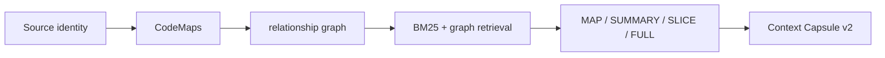

<p align="center">
  
</p>

<h1 align="center">ContextForge</h1>

<p align="center">
  <a href="https://github.com/waterflane/ContextForge/actions/workflows/ci.yml"></a>
  <a href="https://www.python.org/downloads/"></a>
  <a href="LICENSE"></a>
</p>

<p align="center"><strong>Build bounded, reviewable repository context for coding agents.</strong></p>

ContextForge scans local repositories, builds deterministic structural maps,
supports bounded task-aware discovery, and produces portable context packages
and handoffs. It helps you decide what an external coding agent should see
without giving ContextForge permission to edit source code or run arbitrary
commands.

<p align="center">
  <a href="#quick-start">Quick start</a> ·
  <a href="#cli-overview">CLI</a> ·
  <a href="#configuration">Configuration</a> ·
  <a href="https://github.com/waterflane/ContextForge/wiki">Wiki</a> ·
  <a href="https://github.com/waterflane/ContextForge/discussions">Discussions</a> ·
  <a href="CONTRIBUTING.md">Contribution policy</a>
</p>

> [!IMPORTANT]
> ContextForge is pre-alpha software. The current development branch introduces
> Index v3, grounded Semantic Cards, BM25/graph retrieval, Context Capsule v2,
> and Bridge 2.1. Discovery benchmarking is experimental and its results should
> be reviewed alongside the recorded provider, model, configuration, and source
> snapshot.

## Why ContextForge

- **Deterministic repository inventory.** Scan files with stable ordering,
  portable paths, hashes, language classification, ignore rules, and bounded
  reads.
- **Reviewable selection.** Choose exact files, directories, GitWildMatch
  patterns, or line ranges—or ask a configured model for a bounded suggestion.
- **Local repository intelligence.** Publish a usable structural Index v3
  generation first, then optional grounded Semantic Cards and deterministic
  repository maps, all in immutable generations under `.contextforge/index`.
- **Evidence-first retrieval.** Rank exact paths and symbols before persisted
  BM25, then add bounded graph, centrality, diff, and Working Set signals.
  Centrality can refine relevant evidence but cannot admit a file by itself.
- **Portable artifacts.** Export legacy ContextPackage v1/TaskHandoff artifacts
  or a token-budgeted Context Capsule v2 and stable XML prompt.
- **Explicit trust boundaries.** ContextForge does not edit repository source,
  execute repository code, expose shell tools, or mutate Git state.
- **Automation-friendly output.** Structured results stay on stdout while
  normal progress and diagnostics stay on stderr; index jobs can opt into a
  pure schema-3 JSONL progress stream on stdout.

## Representative workflow



A model is optional for scanning, trees, manual context packages, and
structural-only indexing:

```bash
contextforge scan .
contextforge index build . --provider none
contextforge context create . \
  --include pyproject.toml \
  --directory src/contextforge/context \
  --exclude "**/__init__.py" \
  --format markdown \
  --output context.md
```

## Installation

ContextForge requires Python 3.12 or newer. Install the published distribution:

```bash
python -m pip install contextforge-repo
```

For an isolated command-line installation, use either tool manager:

```bash
pipx install contextforge-repo
# or
uv tool install contextforge-repo
```

The PyPI distribution is named `contextforge-repo`; the import package remains
`contextforge`, and the installed commands remain `contextforge` and `ctxf`.
The similarly named `context-forge-cli` distribution is a different,
unaffiliated project.

To install a checked-out source tree instead:

```bash
git clone https://github.com/waterflane/ContextForge.git
cd ContextForge
python -m venv .venv
source .venv/bin/activate
python -m pip install --upgrade pip
python -m pip install .
```

Windows PowerShell:

```powershell
git clone https://github.com/waterflane/ContextForge.git
Set-Location ContextForge
python -m venv .venv
.\.venv\Scripts\Activate.ps1
python -m pip install --upgrade pip
python -m pip install .
```

The installation provides equivalent `contextforge` and `ctxf` console
commands. `python -m contextforge` is also supported.

## Quick start

Inspect a repository without writing ContextForge state:

```powershell
contextforge scan .
contextforge tree . --depth 2
contextforge context create . `
  --include 'pyproject.toml' `
  --directory 'src/contextforge/context' `
  --exclude '**/__init__.py' `
  --format json `
  --output 'context.json'
contextforge context inspect 'context.json'
```

Build a structural-only local index and inspect its status:

```powershell
contextforge index build . --provider none
contextforge index status .
contextforge map .
contextforge context suggest . --task "Trace configuration precedence"
contextforge context create . --task "Trace configuration precedence" `
  --context-tokens 32768 --response-tokens 4096 `
  --format json --output capsule.json --prompt-output prompt.xml
```

> [!TIP]
> Start with manual context creation when you already know the relevant files.
> Use discovery when the task spans unfamiliar code and you have configured a
> supported model provider.

## Common use cases

- create a compact review packet for an external coding agent;
- map a repository without sending source to a model;
- inspect stale, missing, or failed index records;
- discover likely entry points, tests, configuration, and dependencies for a
  task;
- preserve a validated handoff that can be reviewed without the original
  checkout;
- benchmark discovery quality and repeatability against versioned manifests.

## CLI overview

Every command supports `--help`; run group help before using advanced or
mutating operations.

| Command | Behavior | State |
| --- | --- | --- |
| `contextforge version` | Print the installed version | Read-only |
| `contextforge doctor` | Report basic installation settings | Read-only |
| `contextforge scan [PATH]` | Inventory repository files | Read-only unless `--output` is used |
| `contextforge tree [PATH]` | Render a project tree | Read-only unless `--output` is used |
| `contextforge map [PATH]` | Render the active verified orientation map | Read-only |
| `contextforge context suggest [PATH]` | Retrieve Index v3 CandidateCards; legacy discovery is opt-in | Source/index read-only |
| `contextforge context create [PATH]` | Build a manual package or task-based Capsule v2 | Reads source; optional artifact writes |
| `contextforge context inspect ARTIFACT` | Validate ContextPackage v1 or Capsule v2 JSON | Read-only |
| `contextforge context review ARTIFACT` | Review TaskHandoff or Capsule v2 JSON | Read-only |
| `contextforge index build [PATH]` | Publish a new local index generation | Mutates `.contextforge/index` |
| `contextforge index update [PATH]` | Increment an existing index | Mutates `.contextforge/index` |
| `contextforge index status [PATH]` | Inspect source/index drift and lock state | Read-only |
| `contextforge index clean [PATH]` | Delete generated index data | Destructive to index data only |
| `contextforge diagnostics last [PATH]` | Show the latest safe run summary | Read-only |
| `contextforge diagnostics show PATH ID` | Show one safe run summary | Read-only |
| `contextforge diagnostics config [PATH]` | Explain effective configuration | Read-only |
| `contextforge diagnostics provider [PATH]` | Show provider policy without probing it | Read-only |
| `contextforge mcp serve [PATH]` | Run the local read-only stdio MCP server | Read-only session |
| `contextforge bridge --stdio --workspace PATH` | Run negotiated JSON-RPC Bridge 1.0–2.1 | V1 read-only; V2 may atomically mutate only the index |
| `contextforge benchmark discovery PATH` | Run manifest-driven discovery benchmarks | Repository/index read-only; experimental |

Global diagnostic options are `--log-level`, `--log-format`, `--log-file`,
repeatable `--log-component`, `--no-log-file`, `--no-color`, and `-v`/`-vv`.
Detailed syntax, defaults, streams, side effects, mistakes, and examples are in
the [Wiki CLI reference](https://github.com/waterflane/ContextForge/wiki/CLI-Overview).
The local integration contract is documented in the
[bridge integration guide](docs/guides/bridge.md), with a runnable
[generic client](examples/generic_bridge_client.py).

Long model-backed index jobs can stop issuing new work with `--fail-fast` or
`--max-failures N`. Existing `--fail-on-error` semantics are unchanged: without
one of those limits ContextForge finishes the workload and declines publication
if any semantic unit failed. Hosts that launch the CLI can consume full
`ProgressEvent` schema 3 objects with `--progress jsonl`:

```bash
contextforge index update . --provider openai-compatible \
  --model exact/model-id --progress jsonl --max-failures 3 \
  --semantic-scope priority --semantic-max-requests 96 \
  --semantic-max-input-tokens 256000
```

## Configuration

Project configuration is closed, versioned TOML. Resolution order is:

1. command-line option;
2. supported `CONTEXTFORGE_*` environment variable;
3. `.contextforge/config.local.toml`;
4. `.contextforge/config.toml`, or an explicit `--config PATH`;
5. built-in default.

The primary supported environment variables are:

- `CONTEXTFORGE_MODEL_CONTEXT_WINDOW`;
- `CONTEXTFORGE_MODEL_CONNECT_TIMEOUT`;
- `CONTEXTFORGE_MODEL_READ_TIMEOUT`;
- `CONTEXTFORGE_MODEL_OPERATION_TIMEOUT`;
- `CONTEXTFORGE_JSON_REPAIR_ATTEMPTS`;
- `CONTEXTFORGE_LOG_LEVEL`, `CONTEXTFORGE_LOG_FORMAT`,
  `CONTEXTFORGE_LOG_FILE`, and `CONTEXTFORGE_LOG_COMPONENTS`.

The default provider is local Ollama at
`http://127.0.0.1:11434/api/chat` using model `qwen2.5-coder:7b`. Use
`--provider none` for structural-only indexing. The `openai-compatible`
provider and its `lmstudio` CLI alias require an exact model ID and a suitable
`base_url`.

Model-backed discovery requires the configured provider to be running with the
named model available. ContextForge's configured `context_window` must not
exceed the window actually loaded by that provider; inspect the resolved policy
before a long run with `contextforge diagnostics provider PATH`.

Credential configuration stores only the name of an environment variable in
`credential_env`; the credential value is resolved at request time. See the
[configuration guide](docs/guides/configuration.md) and
[Wiki configuration reference](https://github.com/waterflane/ContextForge/wiki/Configuration).

## Retrieval and legacy discovery

With an active Index v3 generation, `context suggest` uses deterministic
CandidateCard retrieval by default. Exact path, qualified-symbol, symbol, and
source-identifier groups precede approximate scores. Approximate ranking uses
persisted BM25 plus bounded graph proximity, centrality, current-diff, and
Working Set signals. `--rerank` permits one closed-schema provider request and
at most one repair; any failure returns the deterministic order. Working Set
and current-diff membership are retained in each CandidateCard's provenance.
Automatic compilation requires an exact, lexical/grounded, graph, diff, or
Working Set signal; centrality alone is not sufficient.

`--legacy-discovery` retains the former model-assisted discovery flow during
deprecation. Its modes remain:

- **Fresh** builds current structural evidence in memory and does not load
  persisted semantic records or repository maps.
- **Indexed** requires a readable active index and uses current indexed
  structure, semantics, and maps.
- **Hybrid** is the default. It starts with current index evidence, fills
  structural gaps from the live snapshot, and explicitly falls back to fresh
  structure when no valid index exists.

All successful selections are verified against current source identities.
Model-backed runs can produce different valid selections; ContextForge claims
deterministic rendering for the same validated result, not deterministic model
behavior. See [Discovery output and benchmarks](docs/guides/discovery.md).

## Context package generation

Manual packages use explicit selectors. With no include selector, all selectable
snapshot files are included up to the configured limits:

```bash
contextforge context create . --include README.md --format markdown
contextforge context create . --directory src --exclude "**/__init__.py"
contextforge context create . --glob "tests/test_*.py" --no-include-tree
contextforge context create . \
  --include pyproject.toml \
  --include-lines pyproject.toml:1-24 \
  --format json
```

Task-based creation uses Context Capsule v2 by default when Index v3 is active:

```bash
contextforge context suggest . \
  --task "Trace configuration precedence" \
  --working-file src/contextforge/project_config.py \
  --no-rerank \
  --format markdown

contextforge context create . \
  --task "Trace configuration precedence" \
  --working-file src/contextforge/project_config.py \
  --context-tokens 32768 \
  --history-tokens 4000 \
  --response-tokens 4096 \
  --git-diff working \
  --format json \
  --output capsule.json \
  --prompt-output prompt.xml
```

Use `--legacy-discovery` for suggestion and `--legacy-handoff` for automatic
creation to retain the deprecated flow. Manual `context create` without a task
is unchanged.

Fully automatic task material targets at most 30% of the available context
budget. Explicit Working Set files/ranges, pinned FULL files, and required Git
material may exceed that soft target, but never the hard budget. A reranker may
give its suggested representation a bounded 10% utility bonus; freshness,
range, FULL, and budget checks remain authoritative.

`context suggest` does not write source or index state, but current diagnostics
policy may write a safe summary under `.contextforge/runs`. Output artifacts are
written atomically; existing destinations require `--force` where that option
is available. In-repository package, capsule, and prompt outputs are registered
by path and SHA-256 in `.contextforge/generated-artifacts.json`; the scanner
skips them only while that digest still matches. Editing an output makes it a
normal source file again. Outputs outside the repository are not registered,
and no filename or content heuristic is used.

## Benchmark workflow

> [!NOTE]
> `benchmark discovery` is experimental in `0.4.2`; model-backed repeatability
> measurements are observations for the recorded fixture state, not guarantees.
> Start the configured provider first and use the same context-window value in
> ContextForge and the provider runtime.

```powershell
contextforge benchmark discovery 'C:\Repositories' `
  --tasks '.\benchmarks\discovery.json' `
  --modes 'fresh,indexed,hybrid' `
  --repeat 3 `
  --format json `
  --output '.\benchmark-report.json'
```

The runner is repository/index read-only, disables configured file logging, and
records complete, failed, and cancelled runs in the result. Exit code `3` means
the command produced a complete benchmark report containing at least one task,
expectation, or budget failure. Do not discard stdout or the requested output
file when handling that code. Every run remains bounded by manifest limits,
provider retry limits, operation timeouts, and the configured context window.

## Output formats and streams

- scans: `table`, `json`;
- trees: `text`, `markdown`, `json`;
- suggestions: `text`, compatibility alias `table`, `markdown`, `json`;
- context packages: `markdown`, `json`;
- index status and diagnostics: `table`, `json`;
- discovery benchmarks: `text`, `markdown`, `json`.

When no output path is supplied, the selected result is written to stdout.
Progress, logs, and errors use stderr, preserving parseable JSON stdout. Some
commands print a confirmation to stdout after writing a file; benchmark output
files are the exception and leave stdout empty.

Common process exit codes are `0` for success, `1` for operational failure, `2`
for invalid usage or configuration, and `130` for cancellation. Exit code `3`
has command-specific meaning: unreadable entries with `scan --fail-on-error`, or
a completed discovery benchmark with regression failures.

## Architecture

ContextForge is a typed Python modular monolith. Core application and domain
logic remain independent from Typer, FastAPI, model-provider implementations,
storage adapters, and editor integrations. The scanner creates a verified
snapshot; intelligence publishes CodeMaps, graph, grounded cards, maps, and
retrieval postings; the context compiler materializes a hard-budgeted Capsule
v2; CLI, Bridge, HTTP, and MCP are thin interfaces.

Read the [architecture overview](docs/architecture/overview.md) for dependency
boundaries and the [security policy](SECURITY.md) for trust and path-safety
details.

## Documentation

- [CLI logging and diagnostics](docs/guides/cli.md)
- [Configuration](docs/guides/configuration.md)
- [Discovery and benchmarking](docs/guides/discovery.md)
- [Index v3 migration](docs/guides/index-v3-migration.md)
- [Development](docs/guides/development.md)
- [Troubleshooting](docs/guides/troubleshooting.md)
- [Architecture notes](docs/architecture/overview.md)
- [Index v3 retrieval and Context Capsule compiler](docs/architecture/index-v3-context-compiler.md)
- [Complete GitHub Wiki](https://github.com/waterflane/ContextForge/wiki)

The Wiki is maintained in its separate GitHub Wiki repository. A prepared local
`wiki/` workspace is intentionally ignored by the main repository.

## Development setup

```powershell
python -m venv .venv
.\.venv\Scripts\Activate.ps1
python -m pip install --upgrade pip
python -m pip install -e ".[dev]"
python -m ruff check .
python -m mypy src
python -m pytest
```

Build validation and owner-only publication steps are in the
[release checklist](docs/RELEASE_CHECKLIST.md). Release publication is an
owner-triggered workflow protected by GitHub environments and PyPI OIDC.

## Project status

ContextForge is pre-alpha and under active solo-maintainer development. Manual
scanning, trees, context packages, local indexing, diagnostics, and read-only
MCP are implemented. Semantic enrichment and optional reranking depend on the
configured provider and its structured-output behavior. Remote MCP transport,
autonomous source edits, shell/process tools, embeddings, IDE extensions, and
coding-agent orchestration are not implemented.

## Support and contributions

Use the Q&A category in GitHub Discussions for usage and support questions.
Use GitHub Issues for reproducible bugs and focused feature suggestions. Do not
post secrets, repository source, full prompts, or private logs in either place.

External contributions are welcome through a fork and pull request into `dev`.
Discuss large changes in an Issue before implementation. Merges require owner
approval and passing CI; contributors do not need direct repository write
access. See [CONTRIBUTING.md](CONTRIBUTING.md).

## License

ContextForge `0.4.2` and later are licensed under the
[Apache License 2.0](LICENSE). Earlier tagged releases remain available under
the license included in those release snapshots. See [NOTICE](NOTICE) for the
project attribution notice.
